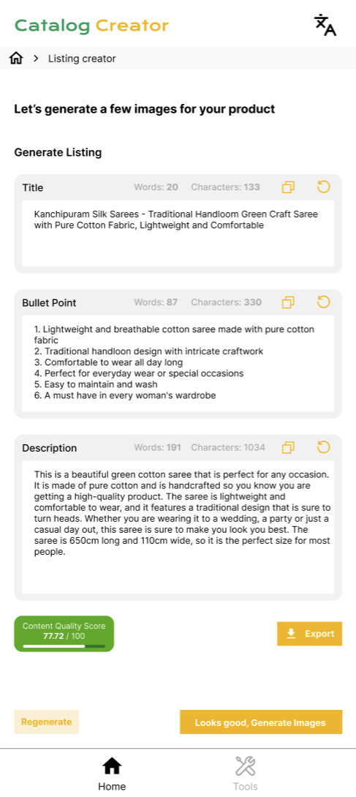

# Seller App Design Document - Catalog Management

## Introduction
This document outlines the design for a seller application that leverages a combination of voice and visual interaction for efficient product management. The app will utilize a central database (PostgreSQL) and Google Cloud Platform (GCP) storage for product information and image hosting, respectively.

## User Interface (UI)
- **Primary Interface:** The app will offer a user-friendly interface with clear navigation for sellers to manage their product catalogs.
- **Voice Support:** While the primary interaction will be visual, optional voice commands can be used for specific actions (e.g., "add new product").

## Functionality
### Catalog Creation
- **Image Upload:** Sellers can upload product images directly from their device's gallery or camera.
- **Automatic Attribute Extraction:** The app can leverage image recognition or pre-trained models to automatically generate basic product attributes based on the uploaded image.
- **Manual Attribute Editing:** A dedicated tab allows sellers to manually add or edit product attributes not captured automatically.
- **Listing Generation:** A separate tab facilitates creating product listings. Sellers can provide voice input (optional) or text for the title and bulleted descriptions.
- **Product Title & Description Generation:** This feature allows sellers to generate product titles and descriptions through text prompts or selecting existing variations.
- **Similar Image Generation:** This feature allows sellers to generate similar variations of the uploaded image through text prompts or selecting existing variations.
- **Image Storage:** All uploaded images will be securely stored in GCP storage.
- **Product Details Storage:** Product information, including title, description, attributes, and image references, will be stored in the PostgreSQL database.

### Database Integration
- The app will be integrated with the central PostgreSQL database.
- New product information will be added to the database upon successful catalog creation.

### Existing Catalog Management
- Sellers can access and manage their existing product catalogs within the app.
- **Catalog Enhancement:** This functionality allows editing existing product listings. Sellers can add new images, modify or add product descriptions, and edit product attributes.

### Duplicate Image Detection
- The app will implement a mechanism to identify duplicate images being added to the catalog.
- Sellers will be notified if an uploaded image already exists in their catalog.

## Technology Stack
### Backend:
- **Programming Language:** Node.js 
- **Database:** PostgreSQL

### Frontend:
- **Mobile Development Framework:** FlutterFlow

## User Experience (UX) Flow

1. User enters product details such as brand, USP, model number, keywords, color, dimensions, and suitability.
2. Data is stored in the PostgreSQL database.
3. User uploads a photo of the product.
4. The app processes the uploaded image.
5. An API call is made to the PostgreSQL database to retrieve relevant product information.
6. Image processing generates similar images based on the upload.
7. Product title, descriptions, and attributes are derived from the details entered by the user.
8. User can manually edit and refine these details.They can use voice feature as well.
9. User finalizes the catalog appearance.
10. The completed catalog creation is confirmed and stored in the database.
11. User successfully creates the catalog hassle-free.
12. The catalog is now available for use by potential buyers.

### Optional APIs:
- **Image Recognition API:** Used for automatic attribute extraction.
- **Text-to-Speech API:** Used for voice interaction.

## Additional Considerations
- **Security:** Implement secure protocols for data transfer between the app, database, and GCP storage.
- **Offline Functionality:** Consider enabling basic functionalities like image selection or attribute editing even when offline (data synchronization upon reconnection).
- **User Roles and Permissions:** Define different user roles within the app with varying access levels for product management.

## Detailed Explanation Of Middleware Use Cases
### Product Information Extraction and Enrichment:
- **product-attributes:** This API extracts basic attributes (color, size, material) from uploaded product images, reducing manual data entry for sellers.
- **product-title and product-desc (or their JSON variants):** Analyzes titles and descriptions for completeness and suggests improvements based on best practices for product listings.

### Image Processing and Optimization:
- **product-image-gen:** Allows generating variations of product images, enriching the product presentation for buyers.

### Data Validation and Consistency:
- Middleware acts as a gatekeeper for product information before it reaches the database.
- **product-title-language and product-desc-lang (or their JSON variants):** Supports multi-language product descriptions by validating language codes.

# Figma Screens

## Images
## Images

|  |  |
|:--:|:--:|
| Seller enters the product details page | Seller Uploads the product image and Generates attributes page |

|  |  |
|:--:|:--:|
| Generate product title, features and description page | Generate more Images of the product |

|  |  |
|:--:|:--:|
| Final Catalog Listing Page | Catalog Creation Confirmed |

# Middleware Use Cases and APIs

This document outlines the middleware use cases, along with their corresponding APIs and endpoints used in the Buyer & Seller App.

## Middleware Use Cases

| Middleware Use Cases      | API's                   | Endpoints                                                                                           |
|---------------------------|-------------------------|-----------------------------------------------------------------------------------------------------|
| Auto-Tagging              | product-attributes      | [https://apps.gcpwkshpdev.com/product/attribs/v2?type=json](https://apps.gcpwkshpdev.com/product/attribs/v2?type=json)             |
| Title (JSON)              | product-title-json      | [https://apps.gcpwkshpdev.com/product/title/v2?type=json](https://apps.gcpwkshpdev.com/product/title/v2?type=json)                 |
| Description (JSON)        | product-desc-json       | [https://apps.gcpwkshpdev.com/product/desc/v2?type=json](https://apps.gcpwkshpdev.com/product/desc/v2?type=json)                   |
| Variation Creation        | product-image-gen       | [https://apps.gcpwkshpdev.com/product/image/gen/v2](https://apps.gcpwkshpdev.com/product/image/gen/v2)                             |

## How to Use

### Integration

1. **Auto-Tagging API**
   - Use the `product-attributes` API endpoint for auto-tagging product attributes.

2. **Title and Description APIs**
   - Utilize `product-title` and `product-desc` APIs for fetching product titles and descriptions respectively.
   - Add `?type=json` for JSON formatted responses.

3. **Variation Creation**
   - Generate product image variations using the `product-image-gen` API endpoint.
# Database Integration for Buyer & Seller App

## Data Model

### Products Table
- **index** (integer)
- **name** (string)
- **price** (float)
- **rating** (float)
- **image** (string)
- **description** (string)
- **is_favorite** (boolean)
- **is_in_cart** (boolean)
- **quantity** (float)
- **category** (string)

### Sellers Table
- **id** (integer)
- **username** (string)
- **password** (string)

## Database Interactions

### Buyer App

#### Read Operations
- Search for products based on title, description, attributes, or category (by querying the Products table).
- Retrieve product details (title, description, image URL, attributes) for a specific product ID.

### Seller App

#### Create Operation
- Create a new product entry (inserting data into the Products table).

#### Read Operations
- Retrieve a list of all products created by a specific seller (using seller_id in the Products table).
- Retrieve details of a specific product for editing (using product ID in the Products table).

#### Update Operation
- Update product details (title, description, attributes) for a specific product (updating relevant fields in the Products table).

#### Delete Operation
- Delete a product (deleting the corresponding entry from the Products table).

