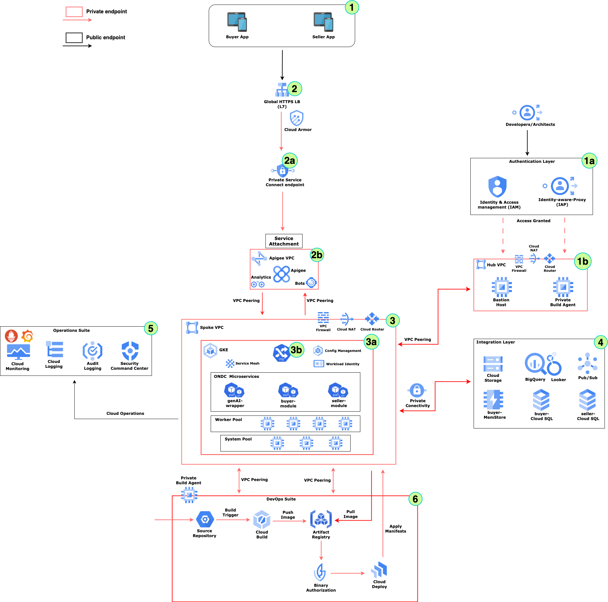
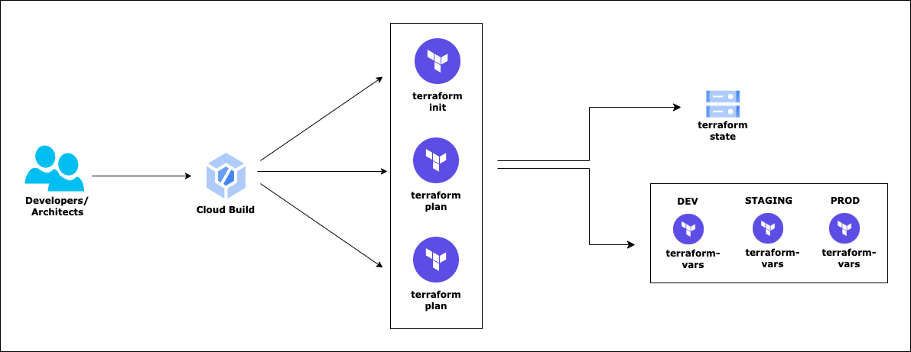
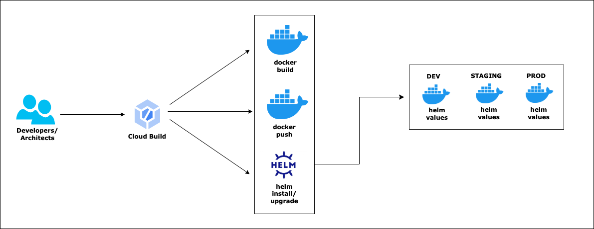
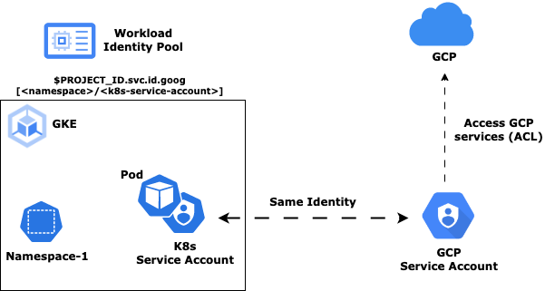
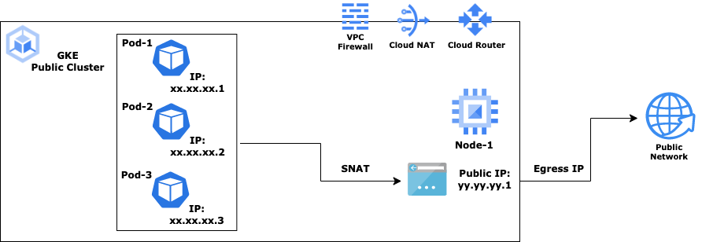
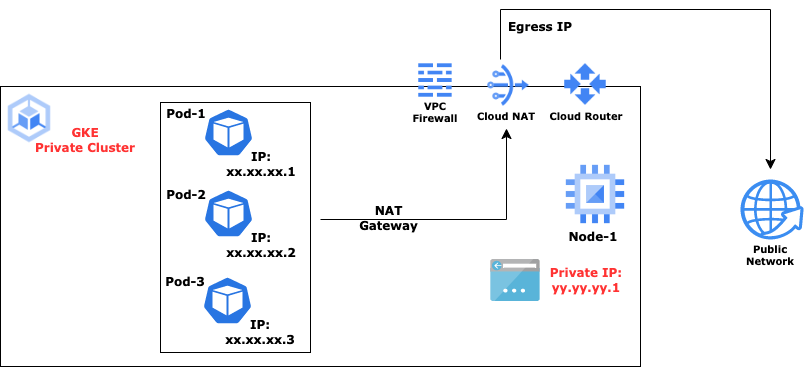

# Landing Zone - Signcatch



## Introduction
SignCatch is a company that develops and offers an innovative omni-channel, cloud-based platform designed for retail stores, cafes, and dining outlets.SignCatch serves in the B2B, SaaS space in the Retail, FinTech market segments.
It has executed the **first Platform-as-a-Service (PaaS) solution-provider**  and it has successfully executed the **world's first export order on the Open Network for Digital Commerce (ONDC)**.

Recently, the company introduced its platforms, Bech.app (B2B Seller) and OrderDe.com (B2B Buyer) on ONDC Network to facilitate cross-border trade 

- **[Bech.app (B2B Seller)](https://www.bech.app/)**: Empowers sellers on the ONDC Network for efficient cross-border trade.
- **[OrderDe.com (B2B Buyer)](https://www.signcatch.com/orderde)**: Facilitates seamless purchasing for buyers on the ONDC Network.

These platforms integrate **genAI plugins from Google**, enhancing their functionality and performance in digital commerce.

Read more about SignCatch's achievements and advancements on the [Economic Times](https://economictimes.indiatimes.com/news/company/corporate-trends/signcatch-executes-first-global-export-trade-on-ondc-network/articleshow/104017719.cms?utm_source=contentofinterest&utm_medium=text&utm_campaign=cppst).


## Objectives

- One-click installer for SignCatch Website deployment.
- Automated deployment across development, staging, and production environments.
- Integration of genAI plugins from Google for their **OrderDe** and **Bech App**.


## Scope
The scope of this project includes:

- Developing a  one-click installer to automate deployment across development, staging, and production environments.
- Providing comprehensive documentation and support resources to assist users in deploying and managing SignCatch's instances efficiently.
- Ensuring compatibility and scalability of the deployment process to accommodate varying organizational needs and system complexities.


## Deployment Approach

Deployment uses the following tools:

- **Terraform for GCP** - Infrastructure deployment
- **Helm chart** - Application/Microservices deployment
- **Cloud Build** - YAML scripts which acts as a wrapper around Terraform Deployment scripts

The entrie Terraform deployment is divided into 3 stages -

- **Pre-Config** stage
  - Create the Landing Zone for the entire deployment
  - Deploy all resources and services that create the building blocks for the entire deployment
- **Setup** Stage
  - Deploy the Core infrastructure
- **Post-Config** Stage
  - Perform all post configurations
  - Deploy additional resouces for integation and end to end flow

### Pre-requisites

- ### [Install the gcloud CLI](https://cloud.google.com/sdk/docs/install)

- #### Alternate

  - #### [Run gcloud commands with Cloud Shell](https://cloud.google.com/shell/docs/run-gcloud-commands)
  
- [**Install kubectl**](https://cloud.google.com/kubernetes-engine/docs/how-to/cluster-access-for-kubectl#apt)

  ```bash
  sudo apt-get update
  sudo apt-get install kubectl
  kubectl version --client
  
  sudo apt-get install google-cloud-sdk-gke-gcloud-auth-plugin
  ```
  
- [**Install Helm**](https://helm.sh/docs/intro/install/)

  ```bash
  curl https://baltocdn.com/helm/signing.asc | gpg --dearmor | sudo tee /usr/share/keyrings/helm.gpg > /dev/null
  
  sudo apt-get install apt-transport-https --yes
  
  echo "deb [arch=$(dpkg --print-architecture) signed-by=/usr/share/keyrings/helm.gpg] https://baltocdn.com/helm/stable/debian/ all main" | sudo tee /etc/apt/sources.list.d/helm-stable-debian.list
  
  sudo apt-get update
  sudo apt-get install helm
  
  helm version --client
  ```

- **Cloud Build - [Helm tool builder](https://github.com/GoogleCloudPlatform/cloud-builders-community/tree/master/helm)**

  - This is the helm builder for cloud build

  - Helps automating deployment of applications and other config files on the GKE cluster using Cloud Build

  - Each Cloud Build pipeline script can contain various **helm** commands as the build step

    ```bash
    # Clone Community Cloud Builder repository
    git clone https://github.com/GoogleCloudPlatform/cloud-builders-community/tree/master/helm
    
    # Build Helm package which would be used inside Cloud Build scripts
    gcloud builds submit . --config=cloudbuild.yaml
    ```

### Workspace - Folder structure

- **signcatch-landing-zone (***Root Folder***)**
  - **assets**
    - images
    - architetcure diagrams
    - ...(more)
  - **builds**
    - **apps** - Deploy/Remove all Application sevices
      - **deploy-script.yaml**
      - **destroy-script.yaml**
    - **config** - Deploy/Remove all Configuration components
      - **deploy-script.yaml**
      - **destroy-script.yaml**
    - **infra** - Deploy/Remove all Infrastrcuture components end to end
      - **deploy-script.yaml**
        - cloud build script for deployment of infrastrcuture components
      - **destroy-script.yaml**
        - cloud build script for removal of infrastrcuture components
  - **deployments -** Store deployment files for all microservices
    - Anthos **Service Mesh** or GKE **Service Mesh**
    - **Balanced Persistent Disk** to host any staeful workloads
    - **CSI Driver Plugin** for mounting/synching secrets from Secret Manager on GCP onto GKE Pods
    - IP Masquerading **Config Map** to force all Egress from GKE to route through NAT Gateway IP (*Only needed fo Public GKE Clusters*)
    - <Additional Configuration components as and when needed>
    - **configs**
      - **ip-masq-cm.yaml**
        - File to ensure egress from GKE (*public*) clsuter through **Cloud NAT** gateway IP
        - This is only needed for **Public** GKE clusters; **NOT** needed for *Private* clusters
      - **istio-manifests**
        - Ingress and Egress gateways provided by Anthos **Service Mesh**
        - Deployed with **3** replicas
          -  Creates [Network Endpoint Group](https://cloud.google.com/kubernetes-engine/docs/how-to/standalone-neg) (NEG)
          -  is deployed as a K8s **ClusterIP** service; **NOT** as a *LoadBalancer*
             - This allows the architecture to save an addtinal Internal *Load Balancer*
      - **pd-balanced-sc.yaml**
        - Create Persisten Volume with **Balanced Persistent Disk** on GCP
      - **provider-gcp-plugin.yaml**
        - CSI Secret storage driver plugin to mount Secrets onto a volume from Secret Manager; as well as sync with K8s secrets/environment variables
    - **smoke**
      - helm chart for deploying **smoke** testing services
    - **accounts**
      - helm chart for deploying core **accounts** services
        - **adapters**
          - email
          - sms
        - **merchant** 
          - dashboard
          - accounts
    - **<Other application specific microservices>**
    - **values-$ENV**
      - **Values** yaml files for each microservice acorss all namespaces and across **dev** environment
      - Passed as argument to each **helm chart template**
- **terraform-scripts**
  - Deployment files for end to end Infrastructure deployment
  - **Pre-config -** Hosts scripts to deploy for all prerequisites of GKE setup
    - **backend.tf -** setup for storing terraform backend state in GCS. Different GCS buckets for each deployment environment
    - **pre-config.tf -** terraform deployment of landing zone components
      - Service Accounts
      - Networks
      - Firewall Policies
      - Artifact Registry
      - Cloud SQL for MySQL
      - Memstore for Redis
      - Reserved Public IPs
      - Cloud NAT gateway

    - **variables.tf -** variable values to be passed to the **pre-config.tf** script specific to the deployment environment.
      - This file will act as a template for actual values to be passed during deployment
      - *Values will change based on the deployment environment*

  - **setup -** Script for setting up of Core Infrastructure
    - **backend.tf -** setup for storing terraform backend state in GCS. Different GCS buckets for each deployment environment

    - **setup.tf -** deployment of GKE cluster
      - Deploy the Core infrastructure
      - **GKE** cluster
      - **System pool** - Nodepool created by default with GKE cluster
      - **Worker pool** - Created specifcially to host Signcatch microservices

    - **variables.tf -** variable values to be passed to the **setup.tf** script specific to the deployment environment
      - This file will act as a template for actual values to be passed during deployment
      - *Values will change based on the deployment environment*

  - **post-config -** Script to perform post configurations
    - **backend.tf -** setup for storing terraform backend state in GCS. Different GCS buckets for each deployment environment

    - **post-config.tf -** Post configurations
    - **variables.tf -** variable values to be passed to the **post-config.tf** script specific to the deployment environment

- **terraform-variables**
  - **dev**
    - **pre-config**
      - **backend.config**
        - GCS path for storing terraform state
      - **pre-config.tfvars**
        - Actual values for the variable template defined in **variables.tf** to be passed to **pre-config.tf** 
    - **setup**
      - **backend.config**
        - GCS path for storing terraform state
      - **setup.tfvars**
        - Actual values for the variable template defined in **variables.tf** to be passed to **setup.tf** 
    - **post-config**
      - **backend.config**
        - GCS path for storing terraform state
      - **post-config.tfvars**
        - Actual values for the variable template defined in **variables.tf** to be passed to **post-config.tf** 
  - **staging**
    - <Simalar as **dev**>
  - **prod**
    - <Simalar as **dev**>
- **misc**
  - Miscellaneous files which are only locally maintained; should not be part of any source code commit ot checkin

### Want to Deep dive - how the terraform scripts are designed?

[**Terraform Scripts**](terraform-scripts)

- Contains core terraform files which deploys or removes the infrastructure

  - **pre-config/pre-config.tf**
  - **setup/setup.tf**
  - **post-config/post-config.tf**

- Each folder imples to a stage in the Landing Zone creation

- Each folder contains a 

  - Variable template file 

    - **variables.tf** - which defines the variables that need to be passed to the above terraform scripts; e.g. Project Name, VPC Name and many more

      ```js
      variable "projectInfo"{
          type = object({
              project = string
              region = string
          })
          
          default = {
              project = ""
              region = "asia-south1"
          }
      }
      .....
      .....
      variable "networkInfo" {
          type = object({
              name =  string
              subnet = string
              opsvmIPName = string
          })
      
          default = {
              name =  "-vpc"
              subnet = "-gke-subnet"
              opsvmIPName = ""
          }
      }
      ```

      

    - **backend.tf** - contains the path of the GCS storage where terraform maintaisn the state of each stage

      ```json
      terraform {
        backend "gcs" {
          bucket = ""
          prefix = ""
        }
      }
      ```

      - Have you noticed, both the files contain empty or dummy values; why?
        - These are only template files for the terraform script to know the variables to be passed
        - Actual values will be passed by the files maintained in the **terraform-variables** directory (*as explained below)*
      - But why is so?
        - Because the variables values will vary from environment to environment viz. dev, staging, production etc. while the terraform scripts will remain same!
        - ***Very important point to note***

**[Terraform Variables](terraform-variables)**

- Contains actual values of the variables defined in **variables.tf** file for each stage as exlained above

- **dev**

  - **backend.config**

    ```json
    bucket = "<GCS bucket to store Terraform state>>"
    prefix = "terraform/state/dev/pre-config"
    ```

  - **pre-config.tfvars**

    ```json
    projectInfo = {
            project = ""
            region = "asia-south1"
    }
    
    serviceAccountInfo = {
        name = "-sa@.iam.gserviceaccount.com"
    }
    
    networkInfo = {
        name = "-vpc"
        auto_create_subnetworks = false
        mtu = 1460
        gke_subnet = {
            name = "-gke-subnet"
            ip_cidr_range = ""
            pods_ip_range = {
                range_name = "pods-range"
                ip_cidr_range = ""
            }
            services_ip_range = {
                range_name = "servicess-range"
                ip_cidr_range = ""
            }
        },
        .....
        ....
    }
    ........
    ........
    opsVMInfo = {
        name = "-ops-vm"
        ip_name = "-opsvm-pub-ip"
        machine_type = "n2d-standard-2"
        zone =  "asia-south1-a"
        boot_disk =  {
            image = "ubuntu-os-cloud/ubuntu-2204-lts"
        }
    }
    
    secretInfo = {
        name = "-secret1"
    }
    ```

    

- **stage**

  - <Simalar as **dev**>

- **production**

  - <Simalar as **dev**>

    

### Infrastructure Deployment



#### Step-by-Step guide

##### Setup CLI environment variables

```bash
BASEFOLDERPATH="${PWD}"
PROJECT_ID=
OWNER=
GSA=$PROJECT_ID-$ENV-sa@$PROJECT_ID.iam.gserviceaccount.com
GSA_DISPLAY_NAME=$PROJECT_ID-$ENV-sa
REGION=
ZONE=
CLUSTER=$PROJECT_ID-$ENV-cluster
DEPLOYMENTS_PATH=$BASEFOLDERPATH/deployments
ENV=
alias k=kubectl
```

##### Authenticate user to gcloud

```bash
gcloud auth application-default login
gcloud auth list
gcloud config set account $OWNER
```

##### Setup current project

```bash
gcloud config set project $PROJECT_ID

gcloud services enable cloudresourcemanager.googleapis.com
gcloud services enable compute.googleapis.com
gcloud services enable container.googleapis.com
gcloud services enable storage.googleapis.com
gcloud services enable artifactregistry.googleapis.com
gcloud services enable run.googleapis.com
gcloud services enable aiplatform.googleapis.com
gcloud services enable translate.googleapis.com
gcloud services enable texttospeech.googleapis.com
gcloud services enable vision.googleapis.com
gcloud services enable apigee.googleapis.com
gcloud services enable servicenetworking.googleapis.com
gcloud services enable cloudkms.googleapis.com
gcloud services enable mesh.googleapis.com
gcloud services enable certificatemanager.googleapis.com
gcloud services enable cloudbuild.googleapis.com
gcloud services enable sqladmin.googleapis.com
gcloud services enable redis.googleapis.com
gcloud services enable secretmanager.googleapis.com

gcloud config set compute/region $REGION
gcloud config set compute/zone $ZONE
```

#### Setup Service Account

Current authenticated user will handover control to a **Service Account** which would be used for all subsequent resource deployment and management

```bash
gcloud iam service-accounts create $GSA_DISPLAY_NAME --display-name=$GSA_DISPLAY_NAME
gcloud iam service-accounts list

# Make SA as the owner
gcloud projects add-iam-policy-binding $PROJECT_ID --member=serviceAccount:$GSA --role=roles/owner

# ServiceAccountUser role for the SA
gcloud projects add-iam-policy-binding $PROJECT_ID --member=serviceAccount:$GSA --role=roles/iam.serviceAccountUser

# ServiceAccountTokenCreator role for the SA
gcloud projects add-iam-policy-binding $PROJECT_ID --member=serviceAccount:$GSA --role=roles/iam.serviceAccountTokenCreator
```

#### Deploy Infrastructure using Terraform

#### Teraform State management

```bash
# Maintains the Terraform state for deployment
gcloud storage buckets create gs://$PROJECT_ID-tfs-stg --project=$PROJECT_ID --default-storage-class=STANDARD --location=$REGION --uniform-bucket-level-access

# List all Storage buckets in the project to check the creation of the new one
gcloud storage buckets list --project=$PROJECT_ID
```

#### Pre-Config

##### Prepare Landing Zone

```bash
cd $BASEFOLDERPATH

# WORKING_DIR for Cloud Build scripts
WORKING_DIR="terraform-scripts/pre-config"

# Path for .tfvars file which supplies actual values to Terraform scripts
TFSVARS_PATH="../../terraform-variables/dev/pre-config"
TFSVARS_FILE_PATH="$TFSVARS_PATH/pre-config.tfvars"

# Backend Config file for Terraform state management
BKEND_CONFIG="$TFSVARS_PATH/backend.config"

# One click of deployment of infrastructure - Pre-Config stage
gcloud builds submit --config="./builds/infra/deploy-script.yaml" \
--project=$PROJECT_ID --substitutions=_PROJECT_ID_=$PROJECT_ID,\
_WORKING_DIR_="$WORKING_DIR",_TFSVARS_FILE_PATH_="$TFSVARS_FILE_PATH",\
_BKEND_CONFIG_="$BKEND_CONFIG",_LOG_BUCKET_=$PROJECT_ID-$ENV-tfs-stg

# Remove/Destroy Pre-Config infrastructure
/*
gcloud builds submit --config="./builds/infra/destroy-script.yaml" \
--project=$PROJECT_ID --substitutions=_PROJECT_ID_=$PROJECT_ID,\
_WORKING_DIR_="$WORKING_DIR",_TFSVARS_FILE_PATH_="$TFSVARS_FILE_PATH",\
_BKEND_CONFIG_="$BKEND_CONFIG",_LOG_BUCKET_=$PROJECT_ID-$ENV-tfs-stg
*/
```

#### Setup

##### Deploy Landing Zone

```bash
cd $BASEFOLDERPATH

# WORKING_DIR for Cloud Build scripts
WORKING_DIR="terraform-scripts/setup"

# Path for .tfvars file which supplies actual values to Terraform scripts
TFSVARS_PATH="../../terraform-variables/dev/setup"
TFSVARS_FILE_PATH="$TFSVARS_PATH/setup.tfvars"

# Backend Config file for Terraform state management
BKEND_CONFIG="$TFSVARS_PATH/backend.config"

# One click of deployment of infrastructure - Setup stage
gcloud builds submit --config="./builds/infra/deploy-script.yaml" \
--project=$PROJECT_ID --substitutions=_PROJECT_ID_=$PROJECT_ID,\
_WORKING_DIR_="$WORKING_DIR",_TFSVARS_FILE_PATH_="$TFSVARS_FILE_PATH",\
_BKEND_CONFIG_="$BKEND_CONFIG",_LOG_BUCKET_=$PROJECT_ID-$ENV-tfs-stg

# Remove/Destroy Pre-Config infrastructure
/*
gcloud builds submit --config="./builds/infra/destroy-script.yaml" \
--project=$PROJECT_ID --substitutions=_PROJECT_ID_=$PROJECT_ID,\
_WORKING_DIR_="$WORKING_DIR",_TFSVARS_FILE_PATH_="$TFSVARS_FILE_PATH",\
_BKEND_CONFIG_="$BKEND_CONFIG",_LOG_BUCKET_=$PROJECT_ID-$ENV-tfs-stg
*/
```

#### Connect to the Cluster

```bash
gcloud container clusters get-credentials $CLUSTER --project=$PROJECT_ID --region=$REGION

#This should fail for Private GKe clusters
k get no

# Private GKE clusters will not allow you to get connected from anywhere; can only connect from Authorized Networksas setup in the setup.tfvars file in the previous step
```


#### Prepare GKE Cluster

##### GKE Service mesh

```bash
cd $BASEFOLDERPATH/
gcloud container clusters get-credentials $CLUSTER --region=$REGION --project=$PROJECT_ID
k create clusterrolebinding cluster-admin-binding --clusterrole=cluster-admin --user=$GSA
mkdir asmmesh
curl https://storage.googleapis.com/csm-artifacts/asm/asmcli_1.19 > $BASEFOLDERPATH/asmcli
chmod +x $BASEFOLDERPATH/asmcli

$BASEFOLDERPATH/asmcli install \
  --project_id $PROJECT_ID --cluster_name $CLUSTER \
  --cluster_location $REGION --fleet_id $PROJECT_ID \
  --output_dir $BASEFOLDERPATH/asmmesh \
  --ca mesh_ca --enable_all

k create namespace asm-ngw-ns
k label namespace asm-ngw-ns istio-injection=enabled
k label namespace istio-system istio-injection=enabled
```

- Configure the GKE cluster with various plugins and controllers befor proceeding to the **Post-Config** step

- These components are as below

  - Ingress and Egress Gateway as provided by Anthos (GKE) **Service Mesh**
  - **Balanced Persistent Disk** to host any staeful workloads
  - **CSI Driver Plugin** for mounting/synching secrets from Secret Manager on GCP onto GKE Pods
  - IP Masquerading **Config Map** to force all Egress from GKE to route through NAT Gateway IP (*Only needed fo Public GKE Clusters*)
  - <Additional Configuration components as and when needed>

- ###### Prepare using Cloud Build

  - Run the following cloud build command directly

  ```bash
  gcloud builds submit --config="./builds/configs/deploy-script.yaml" \
  --project=$PROJECT_ID --substitutions=_PROJECT_ID_=$PROJECT_ID,\
  _REGION_="$REGION",_CLUSTER_NAME_="$CLUSTER",\
  _LOG_BUCKET_=$PROJECT_ID-$ENV-tfs-stg,_ISTIOPATH_="deployments/configs/istio-manifests",\
  _IPMASQ_CONFIG_PATH_="deployments/configs/ip-masq-cm.yaml",\
  _STORAGE_CLASS_CONFIG_PATH_="deployments/configs/pd-balanced-sc.yaml",\
  _CSI_PLUGIN_PATH_="deployments/configs/provider-gcp-plugin.yaml"
  
  #gcloud builds submit --config="./builds/configs/destroy-script.yaml" \
  --project=$PROJECT_ID --substitutions=_PROJECT_ID_=$PROJECT_ID,\
  _REGION_="$REGION",_CLUSTER_NAME_="$CLUSTER",\
  _LOG_BUCKET_=$PROJECT_ID-$ENV-tfs-stg,_ISTIOPATH_="deployments/configs/istio-manifests",\
  _IPMASQ_CONFIG_PATH_="deployments/configs/ip-masq-cm.yaml",\
  _STORAGE_CLASS_CONFIG_PATH_="deployments/configs/pd-balanced-sc.yaml",\
  _CSI_PLUGIN_PATH_="deployments/configs/provider-gcp-plugin.yaml"
  ```

- ###### Configure Manually - step by step (Optional)

  ```bash
  # Deploy Nginx Ingress controller
  gcloud container clusters get-credentials $CLUSTER --project=$PROJECT_ID --region=$REGION
  k get no
  
  # Create SSL Certificate (to be used by Load Balancer)
  gcloud compute ssl-certificates create $CERTIFICATE_NAME --domains=$DOMAIN_NAME --global
  #gcloud compute ssl-certificates delete $CERTIFICATE_NAME
  
  # IP Masquerading (Only needed for GKE public cluster)
  # Without this all egress call will use Public IP of GKE node due to SNAT-ing. This approach prevents SNT-ing and allows the CLoud NAT public gateway IP for all egress from GKE cluster
  
  k get daemonsets/ip-masq-agent -n kube-system
  k get configmaps/ip-masq-agent -n kube-system
  k create cm ip-masq-agent \
     --namespace=kube-system \
     --from-file=config=$BASEFOLDERPATH/deployments/configs/ip-masq-cm.yaml
  k describe configmaps/ip-masq-agent -n kube-system
  k delete cm ip-masq-agent -n kube-system
  
  # K8s Storage Class to create Persistent Volume in the form of a Balanced Disk storage on GCP
  # The disk is not created until a request is made by an application
  k apply -f $BASEFOLDERPATH/deployments/configs/pd-balanced-sc.yaml
  #k delete -f $BASEFOLDERPATH/deployments/configs/pd-balanced-sc.yaml
  
  # objectAdmin Role to the GSA to fetch the items from Storage bucket and Mount in a Volume within the Pod
  # This bukcet is setup during Pre-Config step. Check the variable fuseStorageInfo in pre-config.tfvars file for the bucket name that was set
  gcloud storage buckets add-iam-policy-binding gs://<GCSFUSE Storage Bucket> \
  --member "serviceAccount:$GSA" --role "roles/storage.objectAdmin"
  
  # CSI Drive plugin
  helm repo add secrets-store-csi-driver https://kubernetes-sigs.github.io/secrets-store-csi-driver/charts
  helm install csi-secrets-store secrets-store-csi-driver/secrets-store-csi-driver --namespace kube-system --set "syncSecret.enabled=true" --set "enableSecretRotation=true" 
  #helm uninstall csi-secrets-store --namespace kube-system
  
  k apply -f $BASEFOLDERPATH/deployments/configs/provider-gcp-plugin.yaml
  #k delete -f $BASEFOLDERPATH/deployments/configs/provider-gcp-plugin.yaml
  ```

#### Post-Config

##### Configure Landing Zone

```bash
cd $BASEFOLDERPATH

# WORKING_DIR for Cloud Build scripts
WORKING_DIR="terraform-scripts/post-config"

# Path for .tfvars file which supplies actual values to Terraform scripts
TFSVARS_PATH="../../terraform-variables/dev/post-config"
TFSVARS_FILE_PATH="$TFSVARS_PATH/post-config.tfvars"

# Backend Config file for Terraform state management
BKEND_CONFIG="$TFSVARS_PATH/backend.config"

# One click of deployment of infrastructure - Post-Config stage
gcloud builds submit --config="./builds/infra/deploy-script.yaml" \
--project=$PROJECT_ID --substitutions=_PROJECT_ID_=$PROJECT_ID,_REGION_="$REGION",\
_WORKING_DIR_="$WORKING_DIR",_TFSVARS_FILE_PATH_="$TFSVARS_FILE_PATH",\
_BKEND_CONFIG_="$BKEND_CONFIG",_LOG_BUCKET_=$PROJECT_ID-tfs-stg

# Remove/Destroy Pre-Config infrastructure
/*
gcloud builds submit --config="./builds/infra/destroy-script.yaml" \
--project=$PROJECT_ID --substitutions=_PROJECT_ID_=$PROJECT_ID,_REGION_="$REGION",\
_WORKING_DIR_="$WORKING_DIR",_TFSVARS_FILE_PATH_="$TFSVARS_FILE_PATH",\
_BKEND_CONFIG_="$BKEND_CONFIG",_LOG_BUCKET_=$PROJECT_ID-tfs-stg
*/
```


### Application Deployment



#### Step-by-Step guide

##### Deploy Smoke testing services



- ###### [Workload Identity](https://cloud.google.com/kubernetes-engine/docs/how-to/workload-identity)

  - Workload identity federation for GKE allows workloads in your GKE clusters to impersonate Identity and Access Management (IAM) service accounts to access Google Cloud services
  - Workload Identity is of the form - **$PROJECT_ID.sc.id.goog**
  - **GCP Service Account (GSA)** is of a different format - **<Display_Name>@$PROJECT_ID.iam.gserviceaccount.com**. This is used to access different GCP services/resources with varying access controls as defined by project administrators
  - **K8s Service Account (KSA)** in each namespace within GKE cluster is an identity which is valid within the GKE cluster (*k8s paradigm*) itself; not visible to the other GCP services
  - Workload Identity bridges that gap and provides a connecting identity to GSA of teh form - **$PROJECT_ID.sc.id.goog[<k8s namsedpace>/<k8s-service-account**
  - **KSA** now need to be annotated with **GSA** - *iam.gke.io/gcp-service-account=$GSA*
  - Th KSA is then associated with each Pod of a namespace within GKE cluster
  - Above steps will ensure that all calls from Pod to a GCP service will have same ACL as the **GSA**

##### Deploy Microserices

- **Public GKE cluster** - all below steps can be executed from anywhere

- **Private GKE cluster** - we have two options:

  - **Bastion Host**

    - SSH into Bastion Host or Operatons VM

    - This was created as part of **Pre-Config** step earlier

      ```bash
      gcloud compute ssh <Compute_Engine_Instance_Name>
      ```

    - Clone the repositoty here or Pass on the workspace into this machine by some other means viz. SCP etc.

    - Execute below steps which ae marked as **Manual** -  one by one to deploy all microservices

  - **Private Build Pool**

    - As setup in previous step
    - Execute below steps which ae marked as **Automation** -  one by one to deploy all microservices

#### Deploy Microserices

#### Namespace - smoke

```bash
# Create Namespace
k create ns smoke

# Create K8s SA for smoke namespace
k create serviceaccount smoke-sa -n smoke
#k delete serviceaccount smoke-sa -n smoke

# Provide workloadIdentityUser to the GCP service Account - GSA
gcloud iam service-accounts add-iam-policy-binding $GSA \
    --role=roles/iam.workloadIdentityUser \
    --member="serviceAccount:$PROJECT_ID.svc.id.goog[smoke/smoke-sa]"
#gcloud iam service-accounts remove-iam-policy-binding $GSA \
    --role=roles/iam.workloadIdentityUser \
    --member="serviceAccount:$PROJECT_ID.svc.id.goog[smoke/smoke-sa]"

# Annotate K8s Service Account by GSA service account
k annotate serviceaccount smoke-sa -n smoke iam.gke.io/gcp-service-account=$GSA
#k annotate serviceaccount smoke-sa -n smoke iam.gke.io/gcp-service-account-
```

#### Cloud Build (Automation)

```bash
gcloud builds submit --config="./builds/apps/deploy-script.yaml" \
--project=$PROJECT_ID --substitutions=_PROJECT_ID_=$PROJECT_ID,\
_REGION_="$REGION",_CLUSTER_NAME_="$CLUSTER",\
_LOG_BUCKET_=$PROJECT_ID-tfs-stg,_K8S_NAMESPACE_="smoke",\
_HELM_CHART_NAME_="smoke-chart-nginx",_HELM_CHART_PATH_="deployments/smoke/smoke-chart/",\
_HELM_VALUES_PATH_="deployments/values-$ENV/smoke/values-nginx.yaml"

#gcloud builds submit --config="./builds/apps/destroy-script.yaml" \
--project=$PROJECT_ID --substitutions=_PROJECT_ID_=$PROJECT_ID,\
_REGION_="$REGION",_CLUSTER_NAME_="$CLUSTER",_K8S_NAMESPACE_="smoke",\
_LOG_BUCKET_=$PROJECT_ID-tfs-stg,_HELM_CHART_NAME_="smoke-chart-nginx"
```

#### Manual

```bash
cd $DEPLOYMENTS_PATH/smoke
helm create smoke-chart -n smoke

helm upgrade --install --create-namespace smoke-chart-nginx $DEPLOYMENTS_PATH/smoke/smoke-chart/ -n smoke -f $DEPLOYMENTS_PATH/values-$ENV/smoke/values-nginx.yaml
#helm uninstall smoke-chart-nginx -n smoke
```

#### Check Deployments

```bash
k get po -n smoke
```


#### Namespace - adapters

```bash
# Create Namespace
k create ns adapters

# Create K8s SA for adapters namespace
k create serviceaccount adapters-sa -n adapters
#k delete serviceaccount adapters-sa -n adapters

# Provide workloadIdentityUser to the GCP service Account - GSA
gcloud iam service-accounts add-iam-policy-binding $GSA \
    --role=roles/iam.workloadIdentityUser \
    --member="serviceAccount:$PROJECT_ID.svc.id.goog[adapters/adapters-sa]"
#gcloud iam service-accounts remove-iam-policy-binding $GSA \
    --role=roles/iam.workloadIdentityUser \
    --member="serviceAccount:$PROJECT_ID.svc.id.goog[adapters/adapters-sa]"

# Annotate K8s Service Account by GSA service account
k annotate serviceaccount adapters-sa -n adapters iam.gke.io/gcp-service-account=$GSA
#k annotate serviceaccount adapters-sa -n adapters iam.gke.io/gcp-service-account-

k label namespace adapters istio-injection=enabled
```

#### SMS

##### Create Secret

```bash
k create secret generic smsapp-secrets \
--from-literal=gupshup.sc.otp.api.userid="" \
--from-literal=gupshup.sc.otp.api.password=""\
--from-literal=gupshup.kdp.otp.api.userid="" \
--from-literal=gupshup.kdp.otp.api.password="" \
--from-literal=module.access.key="" \
-n adapters
#k delete secrets smsapp-secrets -n adapters
```

#### Cloud Build (Automation)

```bash
gcloud builds submit --config="./builds/apps/deploy-script.yaml" \
--project=$PROJECT_ID --substitutions=_PROJECT_ID_=$PROJECT_ID,\
_REGION_="$REGION",_CLUSTER_NAME_="$CLUSTER",\
_LOG_BUCKET_=$PROJECT_ID-$ENV-tfs-stg,_K8S_NAMESPACE_="adapters",\
_HELM_CHART_NAME_="accounts-chart-sms",_HELM_CHART_PATH_="deployments/accounts/accounts-chart/",\
_HELM_VALUES_PATH_="deployments/values-$ENV/adapters/values-sms.yaml",\
_GATEWAY_PATH_="deployments/gateways"

#gcloud builds submit --config="./builds/apps/destroy-script.yaml" \
--project=$PROJECT_ID --substitutions=_PROJECT_ID_=$PROJECT_ID,\
_REGION_="$REGION",_CLUSTER_NAME_="$CLUSTER",_K8S_NAMESPACE_="adapters",\
_LOG_BUCKET_=$PROJECT_ID-$ENV-tfs-stg,_HELM_CHART_NAME_="accounts-chart-sms",\
_GATEWAY_PATH_="deployments/gateways"
```

#### Manual

```bash
helm upgrade --install --create-namespace accounts-chart-sms $DEPLOYMENTS_PATH/accounts/accounts-chart/ -n adapters -f $DEPLOYMENTS_PATH/values-$ENV/adapters/values-sms.yaml
#helm uninstall accounts-chart-sms -n adapters
```


#### Email

##### Create Secret

```bash
k create secret generic emailapp-secrets \
--from-literal=module.access.key="" \
--from-literal=spring.sendgrid.api-key="" \
-n adapters
#k delete secrets emailapp-secrets -n adapters
```

#### Cloud Build (Automation)

```bash
gcloud builds submit --config="./builds/apps/deploy-script.yaml" \
--project=$PROJECT_ID --substitutions=_PROJECT_ID_=$PROJECT_ID,\
_REGION_="$REGION",_CLUSTER_NAME_="$CLUSTER",\
_LOG_BUCKET_=$PROJECT_ID-$ENV-tfs-stg,_K8S_NAMESPACE_="adapters",\
_HELM_CHART_NAME_="accounts-chart-email",_HELM_CHART_PATH_="deployments/accounts/accounts-chart/",\
_HELM_VALUES_PATH_="deployments/values-$ENV/adapters/values-email.yaml",\
_GATEWAY_PATH_="deployments/gateways"

#gcloud builds submit --config="./builds/apps/destroy-script.yaml" \
--project=$PROJECT_ID --substitutions=_PROJECT_ID_=$PROJECT_ID,\
_REGION_="$REGION",_CLUSTER_NAME_="$CLUSTER",_K8S_NAMESPACE_="adapters",\
_LOG_BUCKET_=$PROJECT_ID-$ENV-tfs-stg,_HELM_CHART_NAME_="accounts-chart-email",\
_GATEWAY_PATH_="deployments/gateways"
```

#### Manual

```bash
helm upgrade --install --create-namespace accounts-chart-email $DEPLOYMENTS_PATH/accounts/accounts-chart/ -n adapters -f $DEPLOYMENTS_PATH/values-$ENV/adapters/values-email.yaml
#helm uninstall accounts-chart-email -n adapters
```

#### Deploy adapters gateway

```bash
k apply -f $DEPLOYMENTS_PATH/adapters/adapters-gateway.yaml -n adapters
#k delete -f $DEPLOYMENTS_PATH/adapters/adapters-gateway.yaml -n adapters
```

#### Check Deployments

```bash
k get po -n adapters
```


#### Namespace - merchant

```bash
# Create Namespace
k create ns merchant

# Create K8s SA for merchant namespace
k create serviceaccount merchant-sa -n merchant
#k delete serviceaccount merchant-sa -n merchant

# Provide workloadIdentityUser to the GCP service Account - GSA
gcloud iam service-accounts add-iam-policy-binding $GSA \
    --role=roles/iam.workloadIdentityUser \
    --member="serviceAccount:$PROJECT_ID.svc.id.goog[merchant/merchant-sa]"
#cloud iam service-accounts remove-iam-policy-binding $GSA \
    --role=roles/iam.workloadIdentityUser \
    --member="serviceAccount:$PROJECT_ID.svc.id.goog[adapters/merchant-sa]"

# Annotate K8s Service Account by GSA service account
k annotate serviceaccount merchant-sa -n merchant iam.gke.io/gcp-service-account=$GSA
#k annotate serviceaccount merchant-sa -n merchant iam.gke.io/gcp-service-account-

k label namespace merchant istio-injection=enabled
```

#### Dashboard

##### Create Secret

```bash
k create secret generic dashboardapp-secrets \
--from-literal=NEXT_PUBLIC_BECH_REDIRECT_URL="" \
--from-literal=NEXT_PUBLIC_COMPANY_BASE_URL="" \
--from-literal=SMS_BASE_URL="" \
--from-literal=EMAIL_BASE_URL="" \
--from-literal=ACCOUNT_BASE_URL="" \
--from-literal=JWT_SECRET="" \
--from-literal=BYPASS_LOGIN_PASSWORD='' \
--from-literal=NEXT_PUBLIC_API_KEY_GOOGLE_MAPS="" \
--from-literal=SMS_SERVICE_KEY="" \
--from-literal=EMAIL_SERVICE_KEY="" \
--from-literal=ACCOUNT_SERVICE_KEY="" \
-n merchant
#k delete secrets dashboardapp-secrets -n merchant
```

#### Cloud Build (Automation)

```bash
gcloud builds submit --config="./builds/apps/deploy-script.yaml" \
--project=$PROJECT_ID --substitutions=_PROJECT_ID_=$PROJECT_ID,\
_REGION_="$REGION",_CLUSTER_NAME_="$CLUSTER",\
_LOG_BUCKET_=$PROJECT_ID-$ENV-tfs-stg,_K8S_NAMESPACE_="merchant",\
_HELM_CHART_NAME_="accounts-chart-dashboard",_HELM_CHART_PATH_="deployments/accounts/accounts-chart/",\
_HELM_VALUES_PATH_="deployments/values-$ENV/merchant/values-dashboard.yaml",\
_GATEWAY_PATH_="deployments/gateways"

#gcloud builds submit --config="./builds/apps/destroy-script.yaml" \
--project=$PROJECT_ID --substitutions=_PROJECT_ID_=$PROJECT_ID,\
_REGION_="$REGION",_CLUSTER_NAME_="$CLUSTER",_K8S_NAMESPACE_="merchant",\
_LOG_BUCKET_=$PROJECT_ID-$ENV-tfs-stg,_HELM_CHART_NAME_="accounts-chart-dashboard",\
_GATEWAY_PATH_="deployments/gateways"
```

#### Manual

```bash
helm upgrade --install --create-namespace accounts-chart-dashboard $DEPLOYMENTS_PATH/accounts/accounts-chart/ -n merchant -f $DEPLOYMENTS_PATH//values-$ENV/merchant/values-dashboard.yaml
#helm uninstall accounts-chart-dashboard -n merchant
```


#### Accounts

##### Create Secret

```bash
k create secret generic accountsapp-secrets --from-literal=module.access.key="" \
--from-literal=sms.service.access.key="" \
--from-literal=email.service.access.key="" \
--from-literal=spring.read.datasource.url="" \
--from-literal=spring.read.datasource.username= \
--from-literal=spring.read.datasource.password="" \
--from-literal=spring.write.datasource.url="" \
--from-literal=spring.write.datasource.username= \
--from-literal=spring.write.datasource.password="" \
--from-literal=spring.liquibase.url="" \
--from-literal=spring.liquibase.user= \
--from-literal=spring.liquibase.password="" \
-n merchant
#k delete secrets accountsapp-secrets -n merchant
```

#### Cloud Build (Automation)

```bash
gcloud builds submit --config="./builds/apps/deploy-script.yaml" \
--project=$PROJECT_ID --substitutions=_PROJECT_ID_=$PROJECT_ID,\
_REGION_="$REGION",_CLUSTER_NAME_="$CLUSTER",\
_LOG_BUCKET_=$PROJECT_ID-$ENV-tfs-stg,_K8S_NAMESPACE_="merchant",\
_HELM_CHART_NAME_="accounts-chart-accounts",_HELM_CHART_PATH_="deployments/accounts/accounts-chart/",\
_HELM_VALUES_PATH_="deployments/values-$ENV/merchant/values-accounts.yaml",\
_GATEWAY_PATH_="deployments/gateways"

#gcloud builds submit --config="./builds/apps/destroy-script.yaml" \
--project=$PROJECT_ID --substitutions=_PROJECT_ID_=$PROJECT_ID,\
_REGION_="$REGION",_CLUSTER_NAME_="$CLUSTER",_K8S_NAMESPACE_="merchant",\
_LOG_BUCKET_=$PROJECT_ID-$ENV-tfs-stg,_HELM_CHART_NAME_="accounts-chart-accounts",\
_GATEWAY_PATH_="deployments/gateways"
```

#### Manual

```bash
helm upgrade --install --create-namespace accounts-chart-accounts $DEPLOYMENTS_PATH/accounts/accounts-chart/ -n merchant -f $DEPLOYMENTS_PATH/values-$ENV/merchant/values-accounts.yaml
#helm uninstall accounts-chart-accounts -n merchant
```

#### Deploy merchant gateway

```bash
k apply -f $DEPLOYMENTS_PATH/merchant/merchant-gateway.yaml -n merchant
#k delete -f $DEPLOYMENTS_PATH/merchant/merchant-gateway.yaml -n merchant
```

#### Check Deployments

```bash
k get po -n merchant
```


### Clean up

- Resource deployed in each stage (i.e. pre-config, setup, post-config) can be deleted/removed independently

- In case of a requirement of deleting all end to end, we should start from the last step and go backwards i.e.

  - **Setup** - Removes the following resource(s)

    - Nodepools in **GKE cluster**
    - **GKE cluster**

    ```bash
    cd $BASEFOLDERPATH
    
    WORKING_DIR="terraform-scripts/setup"
    TFSVARS_PATH="../../terraform-variables/dev/setup"
    TFSVARS_FILE_PATH="$TFSVARS_PATH/setup.tfvars"
    BKEND_CONFIG="$TFSVARS_PATH/backend.config"
    
    gcloud builds submit --config="./builds/infra/destroy-script.yaml" \
    --project=$PROJECT_ID --substitutions=_PROJECT_ID_=$PROJECT_ID,\
    _WORKING_DIR_="$WORKING_DIR",_TFSVARS_FILE_PATH_="$TFSVARS_FILE_PATH",\
    _BKEND_CONFIG_="$BKEND_CONFIG",_LOG_BUCKET_=$PROJECT_ID-tfs-stg
    ```

  - **Pre-Config** - Removes the following resource(s)

    - Artifact Registry

    - Redis

    - Operations VM

    - Public IP of Load balancer 

    - Public IP of Cliud NAT GAteway

    -  Public IP of Operations VM

    - Firewall Rules and Associations

    - VPC Network and Subnets

      ```bash
      cd $BASEFOLDERPATH
      
      WORKING_DIR="terraform-scripts/pre-config"
      TFSVARS_PATH="../../terraform-variables/dev/pre-config"
      TFSVARS_FILE_PATH="$TFSVARS_PATH/pre-config.tfvars"
      BKEND_CONFIG="$TFSVARS_PATH/backend.config"
      
      gcloud builds submit --config="./builds/infra/destroy-script.yaml" \
      --project=$PROJECT_ID --substitutions=_PROJECT_ID_=$PROJECT_ID,\
      _WORKING_DIR_="$WORKING_DIR",_TFSVARS_FILE_PATH_="$TFSVARS_FILE_PATH",\
      _BKEND_CONFIG_="$BKEND_CONFIG",_LOG_BUCKET_=$PROJECT_ID-tfs-stg
      ```


## Some deep dive

### IP Masquerading





- NAT Gateway provides a public IP and is associated with a VPC. Ideally this wold be used for all Egress calls from the VPC

- One exception is GKE public clusters

  - GKE public cluster has Nodes with **Public** IP

    - Egree calls from Pods would go through SNAT-ing to change the private Pod IP (xx.xx.x.x) to a Public Node IP (yy.yy.yy.y)
    - Nat Gateway Public IP associated with a VPC is ignored
    - This causes problem in white listing by 3rd party vendors as Pods can pbe present in any of the Nodes at a given point of time

  - Use **IP Masquerading** to ensure that there is no SNAT from Pod IP to Node Public IP

    ```yaml
    # ip-masq-cm.yaml
    nonMasqueradeCIDRs:
      - <Public IP to be called from the GKE cluster>/32 # 0.0.0.0/0 for all egress
    masqLinkLocal: false
    resyncInterval: 60s
    ```

    - All egress calls to the specific IP(s) would now be honouring the NAT gateway Public IP; which can now be whitelisted by concerned 3rd party vendors

- GKE Private clusters have Nodes with **Private** IPs only

  - By default all Egress calls will use NAT gateway public IP associate with thew VPC for external calls; no **IP Masquerading** needed here

### How to configure GKE Private Clusters

- **Private** clusters have all Node IPs Private

- Control Plane also not accessible outside the Authorized networks; as defined in the **setup.tfvars** file above

- Please have a look at the [Setup](./terraform-scripts/setup) folder to see how Private Cluster is setup using terraform

- We need to take two steps to conenct to a GKE Private cluster and then configure it

  - **Bastion Host**

    - The Pre-Config step create an Operations VM exactly for this purpose

    - The VM has a public IP and this IP is added as one of the Authoried networks for GKE cluster

      ```bash
      Control plane authorized networks
      (<Bastion_Host_Public_IP>/32)
      ```

    - SSH into the VM

      ```bash
      gcloud compute ssh <Compute_Engine_Instance_Name>
      ```

    - We need to install few tools which would help us to manage the GKE cluster. These are one time installation only

    - [Install gcloud CLI](https://cloud.google.com/sdk/docs/install#deb)

      ```bash
      sudo apt-get update
      sudo apt-get install apt-transport-https ca-certificates gnupg curl
      
      curl https://packages.cloud.google.com/apt/doc/apt-key.gpg | sudo gpg --dearmor -o /usr/share/keyrings/cloud.google.gpg
      
      echo "deb [signed-by=/usr/share/keyrings/cloud.google.gpg] https://packages.cloud.google.com/apt cloud-sdk main" | sudo tee -a /etc/apt/sources.list.d/google-cloud-sdk.list
      
      sudo apt-get update && sudo apt-get install google-cloud-cli
      ```

    - [Install kubectl](https://cloud.google.com/kubernetes-engine/docs/how-to/cluster-access-for-kubectl#apt)

      ```bash
      sudo apt-get update
      sudo apt-get install kubectl
      kubectl version --client
      
      sudo apt-get install google-cloud-sdk-gke-gcloud-auth-plugin
      ```

    - [Install Helm](https://helm.sh/docs/intro/install/)

      ```bash
      curl https://baltocdn.com/helm/signing.asc | gpg --dearmor | sudo tee /usr/share/keyrings/helm.gpg > /dev/null
      
      sudo apt-get install apt-transport-https --yes
      
      echo "deb [arch=$(dpkg --print-architecture) signed-by=/usr/share/keyrings/helm.gpg] https://baltocdn.com/helm/stable/debian/ all main" | sudo tee /etc/apt/sources.list.d/helm-stable-debian.list
      
      sudo apt-get update
      sudo apt-get install helm
      
      helm version --client
      ```

  - **Private Build Pool**

    - **Cloud Buiild** script can run on a default pool or on a private pool of machines
    - **Default** pool can access **Public** GKE cluster biut not **Private** clusters
    - Let us setup a Private Build pool (instead of default one) which can conenct to the **Private GKE cluster**
    - For Public GKE clusters - both default and Private pool can work seamlesly with no additional configuration
    - Setting up a [Private Build Pool](https://cloud.google.com/build/docs/private-pools/create-manage-private-pools) is very simple; but we need some additional configuration to make it work with **Private GKE clusters**. Please follow the steps as described here to [access Private GKE clusters with Cloud Build Private pools](https://cloud.google.com/build/docs/private-pools/accessing-private-gke-clusters-with-cloud-build-private-pools)
    - Once you have this setup and is tested, follow the below steps to configure the cluster.
    - The below script actually consolidates the above manual steps into one

## References

- [GKE Cluster](https://cloud.google.com/kubernetes-engine/docs)
- [Cloud MemoryStore for Redis](https://cloud.google.com/memorystore/docs/redis)
- [GCSFuse with GKE](https://cloud.google.com/kubernetes-engine/docs/how-to/persistent-volumes/cloud-storage-fuse-csi-driver)
- [Secret Manager](https://cloud.google.com/secret-manager/docs)
- [CSi Driver Plugin](https://secrets-store-csi-driver.sigs.k8s.io/)
  - [CSI Drive - GCP Provider](https://github.com/GoogleCloudPlatform/secrets-store-csi-driver-provider-gcp)
